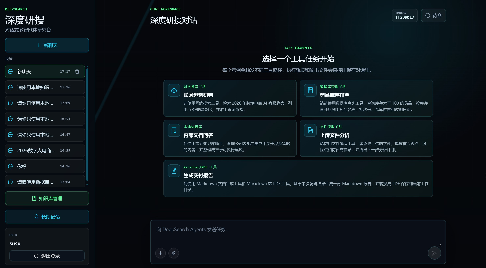
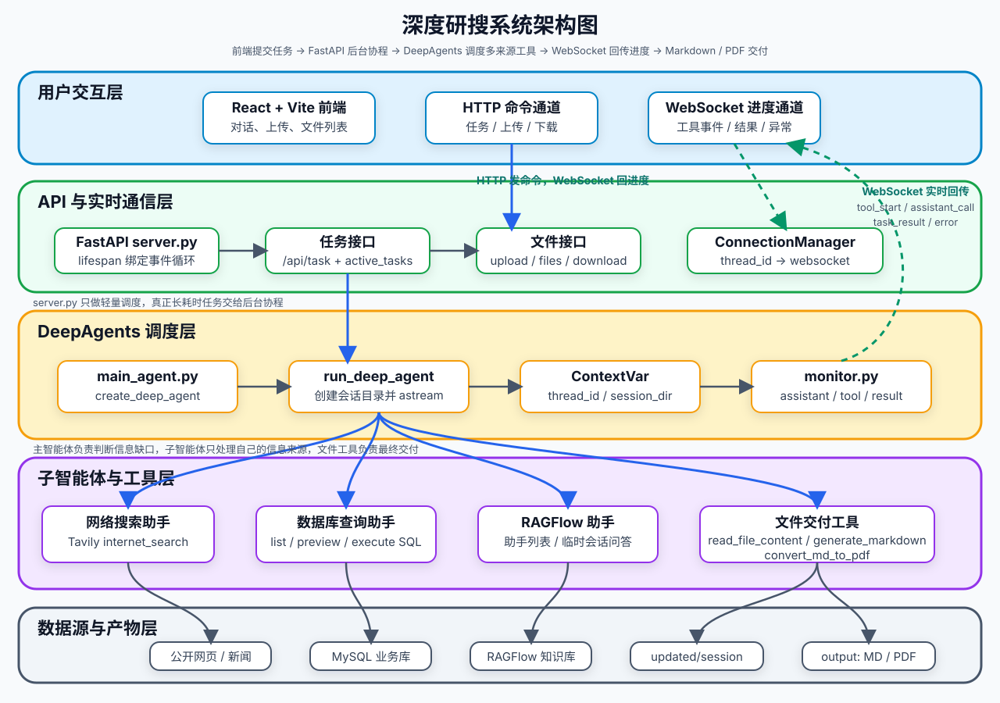

# DeepSearch Agents

基于 DeepAgents 的对话式多智能体深度研究系统。系统能够根据用户任务调度网络搜索、结构化数据库和本地知识库等信息源，读取上传的附件，并将研究结果整理为回答、Markdown 或 PDF 文件。



## 主要功能

- 多智能体协作：主智能体负责规划、调度和汇总，网络搜索、数据库查询、本地知识库三个子智能体负责获取不同来源的信息。
- 多源检索：支持 Tavily、DuckDuckGo、Perplexity、SearXNG、MySQL，以及基于 PostgreSQL、Qdrant 和 FastEmbed 的本地 RAG。
- 文件处理：支持读取 PDF、Word、Excel、Markdown 和文本附件，并生成 Markdown、PDF 等交付文件。
- 实时任务状态：通过 WebSocket 向前端推送工具调用、子智能体执行、结果和异常事件。
- 会话隔离：使用 `thread_id` 和独立会话目录隔离任务上下文、上传文件与生成文件。
- Web 界面：提供任务输入、事件流、附件上传、知识库管理和结果下载功能。

## 系统架构



项目采用 Orchestrator-Workers 模式：

```text
用户任务
  -> FastAPI 接收请求并创建会话
  -> 主智能体分析任务并调度子智能体
  -> 网络搜索 / MySQL / 本地知识库 / 上传文件
  -> 主智能体汇总信息并生成回答或文件
  -> WebSocket 实时推送执行过程
  -> React 前端展示结果和文件
```

核心技术栈：

| 模块       | 技术                                              |
| ---------- | ------------------------------------------------- |
| 智能体     | DeepAgents、LangChain、LangGraph                  |
| 后端       | FastAPI、Uvicorn、WebSocket、Celery               |
| 网络搜索   | Tavily、DuckDuckGo、Perplexity、SearXNG           |
| 结构化数据 | MySQL                                             |
| 本地知识库 | PostgreSQL、Qdrant、MinIO、Redis、FastEmbed       |
| 前端       | React、TypeScript、Vite、Ant Design、Tailwind CSS |
| 依赖管理   | uv、pnpm                                          |

## 项目结构

```text
deepsearch-agents/
├── app/
│   ├── agent/              # 主智能体、子智能体、模型和提示词加载
│   ├── api/                # FastAPI、WebSocket 和知识库接口
│   ├── prompt/             # 智能体提示词配置
│   ├── rag/                # 文档解析、索引、检索、存储和 Celery 任务
│   ├── search/             # 多搜索后端、降级、聚合和正文抓取
│   ├── tools/              # 搜索、数据库、RAG、附件和报告工具
│   └── utils/              # 路径及文档转换工具
├── docker/                 # Dockerfile、Compose 和 MySQL 初始化数据
├── docs/knowledge_base/    # 示例知识库文档
├── frontend/               # React 前端
├── tests/                  # 自动化测试
├── .env.example            # 环境变量示例
└── pyproject.toml          # Python 项目配置
```

## 环境要求

- Python 3.12
- [uv](https://docs.astral.sh/uv/)
- Docker 和 Docker Compose
- Node.js 与 pnpm
- OpenAI 兼容的大模型 API
- 可选的搜索服务凭据：Tavily、Perplexity 或 SearXNG。DuckDuckGo 无需 API Key。

## 快速开始

### 1. 获取代码并配置环境

```bash
git clone https://github.com/huichimegumi/deepsearch-agents.git
cd deepsearch-agents
cp .env.example .env
```

在 Windows PowerShell 中可使用：

```powershell
Copy-Item .env.example .env
```

编辑 `.env`，配置模型地址和名称。密钥既可以填写在仅供本地使用的
`.env` 中，也可以由宿主机环境变量或 CI 密钥管理器注入：

```dotenv
OPENAI_BASE_URL=https://dashscope.aliyuncs.com/compatible-mode/v1
LLM_NAME=qwen-max
DASHSCOPE_API_KEY=
OPENAI_API_KEY=
```

使用 DashScope 时优先配置 `DASHSCOPE_API_KEY`；其他 OpenAI 兼容服务可配置
`OPENAI_API_KEY`。宿主机同名变量优先于 `.env`，Docker Compose 会将最终值传入
API 容器。项目的 `.gitignore` 已忽略 `.env`，真实密钥不会进入版本库。

搜索后端默认为自动降级模式。可按需配置：

```dotenv
SEARCH_BACKEND=auto
SEARCH_BACKEND_ORDER=tavily,searxng,duckduckgo,perplexity
TAVILY_API_KEY=
PERPLEXITY_API_KEY=
SEARXNG_URL=http://localhost:8888
```

需要 Tavily 或 Perplexity 时填写对应变量；未配置的搜索后端会被自动跳过。

其余 RAG、MySQL 和搜索参数可直接参考 [`.env.example`](.env.example)。

### 2. 启动后端服务

使用 Docker Compose 启动 API、RAG Worker 和全部基础设施：

```bash
docker compose -f docker/docker-compose.yaml up -d --build
```

后端默认地址为 `http://localhost:8000`。首次索引知识库文档时会下载 FastEmbed 模型，因此可能需要等待一段时间。

查看服务状态或日志：

```bash
docker compose -f docker/docker-compose.yaml ps
docker compose -f docker/docker-compose.yaml logs -f api rag-worker
```

服务启动后可检查运行状态：

```bash
curl http://localhost:8000/health/live
curl http://localhost:8000/health/ready
```

`live` 只检查 API 进程是否存活；`ready` 还会检查模型配置、PostgreSQL、Redis、Qdrant 和 MinIO。

### 3. 导入示例知识库（可选）

```bash
uv sync
uv run python -m app.rag.bootstrap docs/knowledge_base
```

也可以在前端的知识库管理界面创建知识库并上传文档。

### 4. 启动前端

```bash
cd frontend
pnpm install
pnpm dev
```

浏览器访问 Vite 输出的本地地址，通常为 `http://localhost:5173`。前端默认连接：

```text
API: http://localhost:8000
WS:  ws://localhost:8000
```

如需修改，在 `frontend/.env.local` 中配置：

```dotenv
VITE_API_BASE_URL=http://localhost:8000
VITE_WS_BASE_URL=ws://localhost:8000
```

## 本地开发

如需在本机运行 Python 服务并使用热重载，可只启动基础设施：

```bash
docker compose -f docker/docker-compose.yaml up -d postgres redis qdrant minio mysql
uv sync --group dev
uv run celery -A app.rag.celery_app:celery_app worker --loglevel=INFO --pool=solo
```

另开终端启动 API：

```bash
uv run uvicorn app.api.server:app --host 0.0.0.0 --port 8000 --reload
```

运行后端质量检查和测试：

```bash
uv run ruff check app tests
uv run ruff format --check app tests
uv run pytest
```

构建前端：

```bash
cd frontend
pnpm build
```

## API 概览

| 接口                                       | 用途                 |
| ------------------------------------------ | -------------------- |
| `GET /health/live`                         | API 存活检查         |
| `GET /health/ready`                        | 外部依赖就绪检查     |
| `POST /api/task`                           | 启动研究任务         |
| `POST /api/task/{thread_id}/cancel`        | 取消指定任务         |
| `POST /api/upload`                         | 上传会话附件         |
| `GET /api/files`                           | 获取会话生成文件列表 |
| `GET /api/download`                        | 下载生成文件         |
| `GET /api/knowledge-bases`                 | 获取知识库列表       |
| `POST /api/knowledge-bases`                | 创建知识库           |
| `POST /api/knowledge-bases/{id}/documents` | 上传并索引知识库文档 |
| `GET /api/knowledge-bases/{id}/documents`  | 获取文档及索引状态   |
| `POST /api/knowledge-bases/{id}/search`    | 执行知识库混合检索   |
| `WebSocket /ws/{thread_id}`                | 接收任务实时事件     |

启动后可访问 `http://localhost:8000/docs` 查看完整的 OpenAPI 文档。

## 使用示例

可在前端提交类似任务：

```text
从数据库中查询心血管药品的库存情况，并生成 Markdown 报告。
```

```text
搜索 AI 在电商行业的最新应用趋势，并结合知识库资料生成一份 PDF。
```

```text
读取我上传的行业报告，再结合公开资料整理一份研究摘要。
```

## 数据与输出

- 用户上传文件按会话暂存在 `app/updated/`。
- Markdown、PDF 等生成结果保存在 `app/output/`。
- MySQL 示例数据由 `docker/mysql/mysql.sql` 在数据卷首次创建时导入。
- 知识库原始文件存储在 MinIO，元数据存储在 PostgreSQL，向量索引存储在 Qdrant。
- 本地运行时产生的文件、数据库卷和模型缓存不应提交到版本库。

## 能力边界

当前项目提供完整的多智能体研究与文件交付链路，但不包含以下生产级能力：

- 用户登录、角色权限和多租户隔离
- 文件安全扫描与内容审核
- 大规模分布式任务调度和并发治理
- 完整的历史会话恢复、事件审计和可观测性
- 系统化评测、质量回归和生产发布流程

用于公开网络或生产环境前，请补充身份认证、授权、限流、数据隔离、密钥管理、监控和安全审计。
