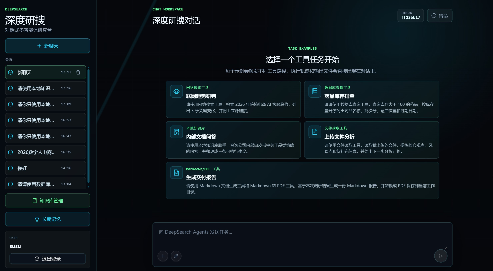

# DeepSearch Agents

<p align="center">
  <a href="#中文">中文</a> | <a href="#english">English</a>
</p>



## 中文

DeepSearch Agents 是一个基于 DeepAgents 的对话式多智能体深度研究系统，支持用户登录、历史会话、短期执行记忆、用户长期记忆、知识库管理、附件读取和多源检索。

### 主要功能

- 阶段式深度研究：后端按固定顺序执行“澄清问题与研究简报 -> Supervisor 分派与 researcher 循环 -> 证据压缩 -> 最终报告”。M0.1 已将 Clarify、Compression 和 Writer 改为直接模型调用，只有 Research 阶段保留 DeepAgent。
- 多智能体研究：主智能体负责分派、反思和汇总，网络搜索、数据库查询、本地知识库三个子智能体分别处理不同信息源。
- 多源检索：支持 Tavily、DuckDuckGo、Perplexity、SearXNG、MySQL，以及基于 PostgreSQL、Qdrant、MinIO、Redis 和 FastEmbed 的本地 RAG。
- 用户与会话：提供注册、登录、JWT 鉴权、会话列表、历史消息恢复、会话归档和按用户隔离的数据目录。
- 记忆系统：包含当前会话摘要、最近消息上下文、LangGraph 短期 checkpoint，以及可由用户管理的长期记忆。
- 文件处理：支持读取 PDF、Word、Excel、Markdown 和文本附件，并生成 Markdown、PDF 等交付文件。
- 实时任务状态：通过 WebSocket 推送工具调用、子智能体执行、最终结果、异常和取消事件。
- 研究阶段追踪：每个阶段的开始、完成和摘要会写入 WebSocket trace 与审计日志，便于复盘 brief、证据账本、压缩证据和最终报告之间的关系。
- 可复现数据评测：固定 DABStep-Research 数据版本、文件哈希、任务子集和 SQL 参考结果，用于逐步验证数据库分析、证据引用与报告生成质量。
- 确定性费率引擎：用 Decimal 执行 DABStep 逐交易费用规则，计算自然月维度指标，并显式返回匹配状态、规则来源和不确定性，不依赖 LLM。
- 统一证据工具：Fee Engine、只读 SQL 和本地文档检索统一返回带稳定 `evidence_id` 的结构化证据，研究、压缩和写作阶段沿用同一引用键。
- Web 工作台：前端提供聊天、任务事件流、附件上传、知识库管理、长期记忆抽屉、历史会话侧栏和结果下载。
- 审计日志：任务开始、结果、取消、异常等事件会按会话写入 `app/logs/session_*.jsonl`，便于排查执行过程。

### Research Core 开发状态

M0 已完成运行级 Budget、结构化 Trace 和端到端 baseline 支持。每次执行都会在会话目录写入 `research_trace.json`，记录阶段耗时、LLM/工具调用、Token、搜索使用量、Waste 和失败原因。

2026-08-17 的首轮 M0 baseline 执行了 5 个纯 Web 报告样本，另外 5 个 MySQL 样本因本地数据库未启动而阻塞。5 个实际执行的样本全部降级，且没有生成要求的 Markdown 文件。Trace 定位到三个直接原因：Clarify 阶段仍可调用 DeepAgents 内建工具并全部超时，Supervisor 声称生成了实际不存在的文件，以及全局 LLM 调用预算在 Compression/Writer 完成前耗尽。

M0.1 稳定性修复现已实现并完成首轮复测。5 个 Web 样本的 Clarify 都缩减为 1 次模型调用，平均 LLM 调用从 19.8 次降到 9.2 次，平均输入 Token 从约 176k 降到约 76.8k。后端为 5 个样本都写入了非空 `report.md`，其中 1 个任务正常完成，4 个任务仍因 Supervisor 或 Compression 超时而降级。P95 从 208.3 秒升到 216.6 秒，尚未达到 180 秒目标。

本轮还发现三个待修复问题。评测提示中的 `convert_md_to_pdf` 工具名称触发了格式误判，导致 Markdown-only 样本额外生成 PDF；Supervisor 仍会调用 DeepAgents 内建的 `write_todos`、`write_file` 和 `read_file`；最终报告中的 URL 与审计日志记录的搜索结果没有精确重合，部分链接带有明显的占位符特征。因此文件交付已经稳定，但报告证据质量尚未达标。当前 `evals/results/report_eval.json` 仍是旧的 M0 汇总，本轮数据来自 5 份新生成的 schema v2 Trace。完整记录见 [M0 development log](docs/development/m0-baseline-budget-trace.md)。

### DABStep 数据基线

项目已加入第一阶段结构化数据研究基线，使用 `RUC-DataLab/DABStep-Research` 的固定提交 `62ae9e0de555a8fb1fd5ab334e0546dbf27aa10c`。`evals/dabstep/dataset.lock.json` 记录 8 个源文件的字节数和 SHA-256，下载器会在使用前逐一校验，防止上游更新导致评测结果漂移。

数据审计确认：任务共 100 个、五类各 20 个，但 Open 类 20 个任务全部没有 checklist；交易表包含 138,236 笔交易和 5 个活跃商户，商户元数据包含 30 行；1,000 条费率规则中同时使用 `null` 和空列表表达通配条件，并引用了 7 个 MCC 参考表中不存在的代码。完整结论见 [DABStep 数据审计](evals/dabstep/AUDIT.md)。

第一阶段固定 8 个原始任务：dev 使用 ID 2、84，holdout 使用 ID 0、3、20、41、47、85。只允许用 dev 调整 prompt、工具和工作流；holdout 用于里程碑验收。任务原文和 checklist 保持不变，附加字段只记录 split、可回答性、限制和必须核验的参考查询。

一条命令可完成固定版本下载、哈希验证、审计产物生成、最小 SQL 导入和参考结果核验：

```powershell
.\.venv\Scripts\python.exe -m evals.dabstep.prepare
```

默认生成本地 SQLite 数据库，不需要启动基础设施；也可以通过 `DABSTEP_DATABASE_URL` 使用 MySQL SQLAlchemy URL。导入器创建交易、商户、收单机构、MCC、费率规则及其规范化关联表。6 组只读参考查询覆盖数据规模、缺失值、商户汇总、卡组织、境内/跨境路由和表行数。`reference_results.json` 仅供离线 evaluator 使用，不应暴露给研究 Agent。原始数据与工作数据库均被 Git 忽略。

M1.1 Fee Rule Engine 已实现为不依赖 LLM 的确定性内核，使用 Decimal 执行逐交易公式，按自然月计算商户交易额和欺诈金额比例，并为每个费用组件返回规则 ID、匹配条件、通配条件和 `fees.json#ID=<id>` 定位。结果状态为 `MATCHED`、`NO_MATCH`、`AMBIGUOUS_SEMANTICS`、`INVALID_SOURCE_DATA` 或 `UNSUPPORTED_RULE`，调用方可以区分真实零费用、未覆盖数据和规则语义风险。

在当前固定数据版本上，引擎对 138,236 笔交易全部给出状态：81,772 笔匹配至少一条规则，已匹配覆盖范围的费用合计为 €95,213.255747；56,464 笔明确标记为 `NO_MATCH`，不会被静默伪装成已验证的零费用。

交叉验证包括 6 个 Adyen DABstep 公开 dev 硬检查和 500 个由独立 SQLite 查询重新匹配的多样化交易样本，规则 ID 与费用金额均无差异。公开 task 2697 的官方答案无法按手册逐交易公式复现，且上游讨论区已有同类质疑，因此被记录为已知上游真值争议，不计入硬检查。`fee_reference_results.json` 只供 evaluator 使用。

如果数据已经下载，可以单独复验费率引擎和已提交的参考结果：

```powershell
.\.venv\Scripts\python.exe -m evals.dabstep.validate_fee_engine --no-download
```

M1.2 已把 Fee Engine、MySQL 和本地知识库检索统一到 `collect_evidence`。工具返回 schema v1 的 `EvidenceBatch`，每条 `EvidenceRecord` 都包含 `evidence_id`、`source`、`locator`、`content` 和 `metadata`。ID 由规范化来源身份和内容摘要生成，不依赖运行时间、检索排名或模型输出：相同 SQL 行、相同文档分块或相同费用计算在重复执行时保持同一 ID；来源内容变化则生成新 ID。

三个来源分别使用不同的可追溯定位方式：SQL 记录绑定数据库身份、规范化查询摘要和行内容摘要；本地文档绑定文档 SHA-256 与 chunk index；费用证据绑定数据集指纹、`psp_reference` 和 `fees.json#ID=<id>` 规则 provenance。SQL 仅允许只读语句，在只读事务内执行并受行数预算限制；本地文档直接返回检索片段，不再先经过一次问答模型改写。

| `source` | 必填输入 | 稳定定位依据 | 主要边界 |
| --- | --- | --- | --- |
| `fee_engine` | `psp_reference`；可选 `aci` | 数据集指纹、交易号、命中规则 ID | 只处理已加载固定数据中的交易；`NO_MATCH` 仍作为可追溯证据返回 |
| `sql` | 只读 `query`，或 `operation=list_tables` | 数据库身份、规范化 SQL 摘要、行内容摘要 | 禁止写语句和多语句；结果受 `DB_QUERY_PREVIEW_ROWS` 限制 |
| `local_document` | `query`；可选 `knowledge_base` | 文档 SHA-256、chunk index、内容摘要 | 依赖已完成索引的本地知识库；结果可能因上下文预算标记为 `PARTIAL` |

应用代码也可以直接调用同一工具：

```python
import json

from app.tools.evidence_tool import collect_evidence

payload = json.loads(
    collect_evidence.invoke(
        {
            "source": "fee_engine",
            "psp_reference": "20034594130",
        }
    )
)
for record in payload["records"]:
    print(record["evidence_id"], record["locator"])
```

返回批次状态为 `OK`、`NO_EVIDENCE`、`PARTIAL` 或 `ERROR`。错误和截断通过 `warnings` 显式返回，不会生成伪造的证据记录。除默认单元测试外，M1.2 现在包含 4 项显式启用的真实基础设施验收：Qdrant 客户端/服务端兼容性、MySQL 只读与稳定 ID、固定 DABStep Fee Evidence，以及跨 PostgreSQL/Qdrant 的本地文档稳定检索。当前开发环境已全部通过；复验命令与失败解释见 [`docs/development/m1-2-live-infrastructure.md`](docs/development/m1-2-live-infrastructure.md)。

最小研究工作流现在要求 Supervisor 只通过 `collect_evidence` 获取这三类内部证据，并在 Evidence Ledger 中原样保留 `evidence_id`。证据压缩和最终报告继续引用 `[evidence_id]`，从而可以从报告追溯到具体 SQL 行、文档片段或费用计算。网络检索仍由独立助手负责，尚未纳入 M1.2 的统一内部证据 schema。Fee 来源默认自动发现唯一的固定 DABStep 快照；存在零个或多个快照时，应通过 `DABSTEP_DATA_DIR` 明确指定目录。

M2.1 在此基础上加入后端强制的 Claim→Evidence 协议。压缩模型不再分别输出 `core_findings` 和 `citations` 字符串列表，而是提交包含 `text`、`evidence_ids`、`kind` 和 `limitations` 的 Claim 草稿。后端只接受引用本轮真实已收集 ID 的 Claim；无证据、未知 ID，以及没有说明限制条件的 inference 会进入 `Rejected claim drafts`，不会作为已验证结论交给 Writer。通过校验的 Claim 获得稳定 `clm1_...` ID。

最终报告生成后还会执行确定性引用检查：Writer 只能引用已接受 Claim 中的 `[evidence_id]`；若引用未知 ID，或在已有有效证据时完全省略引用，后端会拒绝该 Writer 结果、把运行标记为 degraded，并返回经过验证的 Claim Package。Trace schema v3 引入接受/拒绝 Claim 数、证据使用率和最终引用状态；当前 schema v4 在此基础上增加隐私安全的 SQL 修复指标，仍不复制私有证据正文。完整设计与失败行为见 [`docs/development/m2-1-claim-evidence-validation.md`](docs/development/m2-1-claim-evidence-validation.md)。

M2.2 将成功抓取并解析的公开网页正文接入同一证据链。网络搜索结果先标记为候选；只有 `fetch_full_page=true` 且正文抓取成功的页面才会生成稳定 `ev1_web_...`，并进入 Trace、Claim 校验和最终引用门禁。只有标题、URL 或搜索摘要的 `CANDIDATE_ONLY` 结果不属于证据。Web ID 基于规范化 URL 和正文内容寻址，不受排名分数、查询词、搜索后端或跟踪参数变化影响；网页实质内容变化会生成新 ID。详见 [`docs/development/m2-2-web-evidence.md`](docs/development/m2-2-web-evidence.md)。

M3.1 增加 HybridDeepResearch 三题 smoke 适配：三种 SQL/Web 协同模式各选一题，并统一使用一个只读 SQLite 数据库。默认 DuckDuckGo，每题最多两个查询和两个抓取页面，完整运行最多六个查询；任何可能使用 Tavily 等付费额度的模式都必须显式授权。加密题目只在内存解密，结果文件不保存问题、参考答案、SQL 或模型正文。该子集用于发现跨来源链路故障，不代表官方 benchmark 成绩。复现方法见 [`evals/hybrid/README.md`](evals/hybrid/README.md)。

M3.2 完成首次真实 smoke baseline，并据此修复两项执行链缺陷：搜索后端现在使用工具层硬锁，模型不能以 `advanced` 绕过 DuckDuckGo 限制；后端还会维护不写入 telemetry 的有界 Evidence Ledger，即使 Supervisor 没有生成摘要，Compression 仍能收到真实证据。修复后 3/3 报告通过引用校验、2/3 收集到 SQL+Web 双源证据，但严格答案正确率仍为 0/3。当前瓶颈是 SQLite schema 探索和受限预算内的 SQL 修复，而不是搜索数量。完整基线见 [`docs/development/m3-2-hybrid-smoke-baseline.md`](docs/development/m3-2-hybrid-smoke-baseline.md)。

M3.3 为 SQLite Evidence 增加确定性的 schema discovery。`describe_schema` 一次返回表、字段类型、主键、外键和索引的稳定 `ev1_sql_...` Evidence；`sample_table` 只接受 catalog 中的精确表名，并最多返回三行用于判断值域。两者均通过只读连接、查询超时和固定上限约束。冻结的 `alien` 数据库可一次发现全部 11 张表，评测提示词现在要求先查看 schema 再编写 SQL。实现与边界见 [`docs/development/m3-3-sqlite-schema-discovery.md`](docs/development/m3-3-sqlite-schema-discovery.md)。

M3.4 在 Evidence Tool 边界执行 SQL 修复上限：首次失败后只允许一条不同的修复 SQL，原样重复会被拒绝；若修复仍失败，后续查询不会触达数据库。成功查询会重置连续失败计数。Trace schema v4 只保存查询摘要、成功/失败/拦截数量和有限错误类别，不保存 SQL 或数据库错误正文；Hybrid smoke 汇总也暴露这些指标。详见 [`docs/development/m3-4-bounded-sql-repair.md`](docs/development/m3-4-bounded-sql-repair.md)。

上游 `DABStep-Research` 仓库当前没有声明许可证。相关原始数据只按锁文件下载到本地，在许可证澄清前不应随本项目重新分发。详细命令和 MySQL 配置见 [DABStep baseline README](evals/dabstep/README.md)。

### 系统架构

项目采用 Orchestrator-Workers 模式，并把会话、记忆和检索状态持久化到本地基础设施中：

```text
用户登录 / 前端会话
  -> FastAPI 鉴权并创建 thread_id
  -> 注入历史会话摘要、最近消息和长期记忆
  -> 阶段 1：澄清问题并生成 research brief
  -> 阶段 2：Supervisor 直接调用 Evidence Tool 获取 Fee / SQL / 本地文档证据
  -> 阶段 2：网络助手发现候选并抓取正文，生成稳定 Web Evidence；同时读取上传附件 / 记忆
  -> 阶段 2：Researcher 根据证据缺口进行定向补检索和反思
  -> 阶段 3：生成 Claim 草稿；后端校验 Claim→Evidence 关系并拒绝未知或缺失 ID
  -> LangGraph checkpoint 保存同一 thread 的短期执行上下文
  -> 阶段 4：Writer 基于 Validated Claim Package 返回 Markdown；后端复核引用后落盘
  -> WebSocket 实时推送过程和结果
  -> 写入历史消息、更新会话摘要、抽取长期记忆
```

核心技术栈：

| 模块 | 技术 |
| --- | --- |
| 智能体 | DeepAgents、LangChain、LangGraph |
| 后端 | FastAPI、Uvicorn、WebSocket、Celery |
| 认证与会话 | JWT、passlib/bcrypt、SQLAlchemy |
| 网络搜索 | Tavily、DuckDuckGo、Perplexity、SearXNG |
| 结构化数据 | MySQL |
| 本地知识库 | PostgreSQL、Qdrant、MinIO、Redis、FastEmbed |
| 记忆 | PostgreSQL、Qdrant、LangGraph checkpointer |
| 前端 | React、TypeScript、Vite、Ant Design、Tailwind CSS |
| 依赖管理 | uv、pnpm |

### 记忆与会话机制

项目里有几类“记忆”，用途不同：

- 历史会话：`chat_conversations` 和 `chat_messages` 存储每个用户的会话、消息、标题和归档状态，前端可恢复历史聊天。
- 会话摘要：任务结束后会维护当前 thread 的滚动摘要，并在下一轮同一会话中注入提示词，适合保留目标、结论、约束和待办。
- 最近消息：每轮执行会带入当前会话最近若干条消息，避免模型只看到本轮问题。
- 短期 checkpoint：LangGraph checkpointer 按 `user_id__thread_id` 保存智能体图状态，默认使用 PostgreSQL；不可用时可按配置退回进程内存。
- 长期记忆：`user_memories` 存储稳定偏好、事实、项目背景、指令和摘要，并同步到 Qdrant 做语义召回；前端“长期记忆”抽屉可新增、搜索和删除。

长期记忆保存前会过滤明显的 API key、密码、token 等敏感内容。Agent 可以在用户明确要求“记住”时调用 `remember_user_memory` 工具保存记忆；每次任务开始时会按当前问题检索相关长期记忆，并按优先级注入简短记忆块：持续指令、项目背景、用户偏好、稳定事实、摘要。若长期记忆与本轮明确要求冲突，以本轮要求为准。

任务完成后，系统会用更保守的中英双语记忆抽取提示词尝试提取长期记忆。默认只自动抽取三类内容：用户明确偏好、长期项目背景、持续性指令；普通事实、网页/数据库/RAG 证据、一次性任务细节和仅由助手推断出的结论不会自动写入。自动抽取最多保留 3 条，且候选置信度必须不低于 0.72。

相关环境变量：

```dotenv
MEMORY_QDRANT_COLLECTION=user_memories
MEMORY_TOP_K=6
MEMORY_MIN_CONFIDENCE=0.55
SHORT_TERM_MEMORY_BACKEND=postgres
SHORT_TERM_MEMORY_DATABASE_URL=
SHORT_TERM_MEMORY_POOL_SIZE=8
SHORT_TERM_MEMORY_FALLBACK_ENABLED=true
```

`SHORT_TERM_MEMORY_DATABASE_URL` 为空时复用 `RAG_DATABASE_URL`。如果希望调试时完全不持久化短期 checkpoint，可设置 `SHORT_TERM_MEMORY_BACKEND=memory`。

### 项目结构

```text
deepsearch-agents/
├── app/
│   ├── agent/              # 主智能体、子智能体、模型和提示词加载
│   ├── api/                # FastAPI、WebSocket、会话、知识库、健康检查和审计
│   ├── auth/               # 注册、登录、JWT 和当前用户依赖
│   ├── memory/             # 长期记忆、会话摘要和 LangGraph checkpoint
│   ├── prompt/             # 智能体提示词配置
│   ├── rag/                # 文档解析、索引、检索、存储、模型和 Celery 任务
│   ├── research/           # 确定性研究内核：Fee Rule Engine、Evidence schema 与最小工作流
│   ├── search/             # 多搜索后端、降级、聚合和正文抓取
│   ├── tools/              # 搜索、数据库、RAG、附件、记忆和报告工具
│   └── utils/              # 路径及文档转换工具
├── docker/                 # Dockerfile、Compose 和 MySQL 初始化数据
├── evals/dabstep/          # 固定数据版本、审计、任务子集、SQL 导入和参考核验
├── data/knowledge_base/    # 本地 RAG 语料目录（不提交到 git）
├── data/benchmarks/        # 下载的评测原始数据（不提交到 git）
├── frontend/               # React 前端
├── tests/                  # 自动化测试
├── .env.example            # 环境变量示例
└── pyproject.toml          # Python 项目配置
```

### 环境要求

- Python 3.12
- [uv](https://docs.astral.sh/uv/)
- Docker 和 Docker Compose
- Node.js 与 pnpm
- OpenAI 兼容的大模型 API
- 可选搜索服务凭据：Tavily、Perplexity 或 SearXNG。DuckDuckGo 无需 API Key。

### 快速开始

#### 1. 获取代码并配置环境

```bash
git clone https://github.com/huichimegumi/deepsearch-agents.git
cd deepsearch-agents
cp .env.example .env
```

Windows PowerShell 可使用：

```powershell
Copy-Item .env.example .env
```

编辑 `.env`，至少配置模型地址、模型名称和密钥：

```dotenv
OPENAI_BASE_URL=https://dashscope.aliyuncs.com/compatible-mode/v1
LLM_NAME=qwen-max
DASHSCOPE_API_KEY=
OPENAI_API_KEY=
```

使用 DashScope 时优先配置 `DASHSCOPE_API_KEY`；其他 OpenAI 兼容服务可配置 `OPENAI_API_KEY`。宿主机同名变量优先于 `.env`，Docker Compose 会将最终值传入 API 容器。

搜索后端默认为自动降级模式：

```dotenv
SEARCH_BACKEND=auto
SEARCH_BACKEND_ORDER=tavily,searxng,duckduckgo,perplexity
TAVILY_API_KEY=
PERPLEXITY_API_KEY=
SEARXNG_URL=http://localhost:8888
```

未配置的搜索后端会被自动跳过。其余 RAG、记忆、MySQL 和搜索参数可参考 [`.env.example`](.env.example)。

#### 2. 启动后端服务

使用 Docker Compose 启动 API、RAG Worker 和全部基础设施：

```bash
docker compose --env-file .env -f docker/docker-compose.yaml up -d --build
```

后端默认地址为 `http://localhost:8000`。首次索引知识库文档或首次使用记忆语义检索时会下载 FastEmbed 模型，因此可能需要等待一段时间。

查看服务状态或日志：

```bash
docker compose --env-file .env -f docker/docker-compose.yaml ps
docker compose --env-file .env -f docker/docker-compose.yaml logs -f api rag-worker
```

服务启动后可检查运行状态：

```bash
curl http://localhost:8000/health/live
curl http://localhost:8000/health/ready
```

`live` 只检查 API 进程是否存活；`ready` 会检查模型配置、PostgreSQL、短期记忆、Redis、Qdrant 和 MinIO。

#### 3. 导入示例知识库（可选）

```bash
uv sync
uv run python -m app.rag.bootstrap data/knowledge_base
```

也可以在前端的知识库管理界面创建知识库并上传文档。

#### 4. 启动前端

```bash
cd frontend
pnpm install
pnpm dev
```

浏览器访问 Vite 输出的本地地址，通常为 `http://localhost:5173`。前端默认连接：

```text
API: http://localhost:8000
WS:  ws://localhost:8000
```

如需修改，在 `frontend/.env.local` 中配置：

```dotenv
VITE_API_BASE_URL=http://localhost:8000
VITE_WS_BASE_URL=ws://localhost:8000
```

首次进入前端需要注册或登录。注册开关由 `ALLOW_REGISTER` 控制，默认允许；公开部署前应改为关闭或接入正式用户体系。`JWT_SECRET_KEY` 默认值仅适合本地开发，部署时必须替换。

### 本地开发

如需在本机运行 Python 服务并使用热重载，可只启动基础设施：

```bash
docker compose --env-file .env -f docker/docker-compose.yaml up -d postgres redis qdrant minio mysql
uv sync --group dev
uv run celery -A app.rag.celery_app:celery_app worker --loglevel=INFO --pool=solo
```

另开终端启动 API：

```bash
uv run uvicorn app.api.server:app --host 0.0.0.0 --port 8000 --reload
```

运行后端质量检查和测试：

```bash
uv run ruff check app tests
uv run ruff format --check app tests
uv run pytest
```

构建前端：

```bash
cd frontend
pnpm build
```

### API 概览

会话、任务、文件和记忆接口需要 `Authorization: Bearer <token>`。WebSocket 连接通过查询参数传入 token，例如 `/ws/{thread_id}?token=<token>`。知识库接口当前是全局资源接口，尚未按用户隔离。

| 接口 | 用途 |
| --- | --- |
| `POST /api/auth/register` | 注册用户并返回 token |
| `POST /api/auth/login` | 登录并返回 token |
| `GET /api/auth/me` | 获取当前用户 |
| `GET /health/live` | API 存活检查 |
| `GET /health/ready` | 外部依赖就绪检查 |
| `POST /api/task` | 启动研究任务 |
| `POST /api/task/{thread_id}/cancel` | 取消指定任务 |
| `POST /api/upload` | 上传会话附件 |
| `GET /api/files` | 获取当前用户生成文件列表 |
| `GET /api/download` | 下载当前用户生成文件 |
| `GET /api/conversations` | 获取当前用户会话列表 |
| `POST /api/conversations` | 创建会话 |
| `GET /api/conversations/{thread_id}` | 获取会话详情和历史消息 |
| `PATCH /api/conversations/{thread_id}` | 更新标题或归档状态 |
| `DELETE /api/conversations/{thread_id}` | 归档会话并清理短期 checkpoint |
| `GET /api/memories` | 获取长期记忆 |
| `POST /api/memories` | 手动创建长期记忆 |
| `POST /api/memories/search` | 检索长期记忆 |
| `PATCH /api/memories/{memory_id}` | 更新长期记忆 |
| `DELETE /api/memories/{memory_id}` | 删除长期记忆 |
| `GET /api/knowledge-bases` | 获取知识库列表 |
| `POST /api/knowledge-bases` | 创建知识库 |
| `DELETE /api/knowledge-bases/{id}` | 删除知识库 |
| `POST /api/knowledge-bases/{id}/documents` | 上传并索引知识库文档 |
| `GET /api/knowledge-bases/{id}/documents` | 获取文档及索引状态 |
| `POST /api/knowledge-bases/documents/{document_id}/reindex` | 重新索引文档 |
| `DELETE /api/knowledge-bases/documents/{document_id}` | 删除文档 |
| `GET /api/knowledge-bases/index-jobs/{job_id}` | 查询索引任务状态 |
| `POST /api/knowledge-bases/{id}/search` | 执行知识库混合检索 |
| `WebSocket /ws/{thread_id}` | 接收任务实时事件 |

启动后可访问 `http://localhost:8000/docs` 查看完整 OpenAPI 文档。

### 使用示例

可在前端提交类似任务：

```text
从数据库中查询心血管药品的库存情况，并生成 Markdown 报告。
```

```text
搜索 AI 在电商行业的最新应用趋势，并结合知识库资料生成一份 PDF。
```

```text
记住：我更喜欢先给结论、再列证据。然后读取我上传的行业报告，整理一份研究摘要。
```

```text
结合我之前关于电商直播项目的长期记忆，搜索最新公开资料并生成一份竞品分析。
```

### 数据与输出

- 用户上传文件按用户和会话暂存在 `app/updated/user_{user_id}/session_{thread_id}/`。
- Markdown、PDF 等生成结果保存在 `app/output/user_{user_id}/session_{thread_id}/`。
- 会话审计日志保存在 `app/logs/session_{user_id}__{thread_id}.jsonl`。
- 用户、会话、消息、长期记忆、知识库元数据和文档 chunk 存储在 PostgreSQL。
- 长期记忆和知识库 chunk 的向量索引存储在 Qdrant。
- 知识库原始文件存储在 MinIO。
- RAG 索引任务使用 Redis 和 Celery Worker 执行。
- MySQL 示例数据由 `docker/mysql/mysql.sql` 在数据卷首次创建时导入。
- DABStep 原始数据下载到 `data/benchmarks/dabstep_research/<revision>/`，本地参考数据库保存在 `evals/dabstep/work/`；两者均不提交到版本库。
- 本地运行时产生的输出文件、数据库卷、日志和模型缓存不应提交到版本库。

### 能力边界

当前项目已经具备基本用户体系、会话隔离和可管理记忆，但仍不是开箱即用的生产系统：

- 默认注册、JWT 密钥和本地服务凭据主要面向开发环境。
- 尚未提供角色权限、组织/租户管理、精细授权和限流。
- 文件安全扫描、内容审核和敏感数据治理仍需外部补齐。
- 长任务并发、队列治理、可观测性和告警仍偏向本地开发形态。
- 记忆抽取依赖模型判断，重要生产场景应增加人工确认、评测和回滚机制。
- DABStep 当前手续费已具备确定性规则匹配和独立交叉验证，但 `NO_MATCH` 交易必须单独披露；未来转化率、因果结论和反事实节省额仍只能作为带假设的分析结果。

用于公开网络或生产环境前，请补充正式身份认证、授权策略、限流、数据隔离、密钥管理、监控告警、安全审计和质量回归流程。

---

## English

DeepSearch Agents is a conversational multi-agent deep research system built on DeepAgents. It supports user authentication, conversation history, short-term execution memory, long-term user memory, knowledge-base management, attachment reading, and multi-source retrieval.

### Features

- Staged deep research: the backend runs clarification and research brief, supervisor dispatch and researcher reflection, evidence compression, and final report in a fixed order. M0.1 moved clarification, compression, and writing to direct model calls. Only the research phase uses a DeepAgent.
- Multi-agent research: the main agent dispatches, reflects, and synthesizes work, while dedicated sub-agents handle web search, database queries, and local knowledge-base retrieval.
- Multi-source retrieval: supports Tavily, DuckDuckGo, Perplexity, SearXNG, MySQL, and local RAG based on PostgreSQL, Qdrant, MinIO, Redis, and FastEmbed.
- Users and conversations: includes registration, login, JWT authentication, conversation lists, historical message recovery, conversation archiving, and user-isolated data directories.
- Memory system: combines current conversation summaries, recent message context, LangGraph short-term checkpoints, and user-managed long-term memories.
- File handling: reads PDF, Word, Excel, Markdown, and text attachments, and can generate Markdown or PDF deliverables.
- Real-time task status: streams tool calls, sub-agent execution, final results, errors, and cancellation events through WebSocket.
- Research phase tracing: each phase start, completion, and summary is written to the WebSocket trace and audit log so the brief, evidence ledger, compressed evidence, and final report can be reviewed together.
- Reproducible data evaluation: pins the DABStep-Research revision, source hashes, task subset, and SQL reference results for incremental validation of database analysis, evidence grounding, and report generation.
- Deterministic fee engine: evaluates DABStep transaction-level fee rules with Decimal arithmetic and natural-month metrics, returning explicit statuses, rule provenance, and uncertainty without an LLM dependency.
- Unified evidence tool: normalizes Fee Engine, read-only SQL, and local-document retrieval into structured evidence with stable `evidence_id` values preserved across research, compression, and writing.
- Web workspace: the frontend provides chat, a task event stream, attachment uploads, knowledge-base management, a long-term memory drawer, a history sidebar, and result downloads.
- Audit logs: task starts, results, cancellations, and errors are written by session to `app/logs/session_*.jsonl` for easier troubleshooting.

### Research Core status

M0 adds run-level budgets, structured traces, and baseline aggregation. Every executed task writes `research_trace.json` with phase timing, LLM and tool usage, token counts, search activity, waste counters, and failure reasons.

The first M0 baseline on 2026-08-17 executed five web-report samples. Five MySQL samples were blocked because the local database was unavailable. All five executed samples degraded, and none created the required Markdown artifact. The trace identified three immediate causes: the clarification phase could still call DeepAgents built-in tools and timed out in every run, supervisors claimed files that did not exist, and the global LLM-call budget was exhausted before compression or writing completed.

M0.1 stabilization is implemented and has completed its first rerun. Clarification used exactly one model call in all five web samples. Average LLM calls fell from 19.8 to 9.2 per task, and average input tokens fell from about 176k to 76.8k. Backend code wrote a non-empty `report.md` for every sample. One task completed normally, while four still degraded because the supervisor or compression phase timed out. P95 latency increased from 208.3 to 216.6 seconds, so the 180-second target remains unmet.

The rerun also exposed three follow-up issues. The `convert_md_to_pdf` tool name inside the eval prompt caused every Markdown-only task to generate an unwanted PDF. The research supervisor still used DeepAgents built-ins such as `write_todos`, `write_file`, and `read_file`. Final-report URLs had no exact overlap with the search-result URLs recorded in the audit logs, and several had obvious placeholder patterns. File delivery is now reliable, but evidence grounding is not. The current `evals/results/report_eval.json` is still the older M0 aggregate; the M0.1 measurements come from the five new schema v2 traces. See the [M0 development log](docs/development/m0-baseline-budget-trace.md) for the full comparison.

### DABStep Data Baseline

The project now includes its first structured-data research baseline. It pins `RUC-DataLab/DABStep-Research` at revision `62ae9e0de555a8fb1fd5ab334e0546dbf27aa10c`. `evals/dabstep/dataset.lock.json` records the byte size and SHA-256 digest of all eight source files, and the downloader verifies every file before it is used so upstream changes cannot silently alter evaluation results.

The audit found 100 tasks distributed evenly across five categories, but all 20 Open tasks have empty checklists. The transaction table contains 138,236 payments from 5 active merchants, while merchant metadata contains 30 rows. The 1,000 fee rules use both `null` and empty lists as wildcard-like conditions and reference 7 MCC values missing from the MCC lookup table. See the [DABStep data audit](evals/dabstep/AUDIT.md) for the complete findings.

The first phase freezes eight original tasks. IDs 2 and 84 form the development split; IDs 0, 3, 20, 41, 47, and 85 form the holdout split. Prompts, tools, and workflows may be tuned only on the development tasks. Holdout tasks are reserved for milestone acceptance. Original questions and checklists remain unchanged; added metadata records the split, answerability level, known limitations, and required reference checks.

One command downloads the pinned snapshot, verifies its hashes, regenerates the audit artifacts, imports the minimal SQL schema, and checks the database against committed reference results:

```powershell
.\.venv\Scripts\python.exe -m evals.dabstep.prepare
```

The default target is a local SQLite database and requires no infrastructure services. A MySQL SQLAlchemy URL can be supplied through `DABSTEP_DATABASE_URL`. The importer creates transaction, merchant, acquirer, MCC, fee-rule, and normalized fee-condition tables. Six read-only query groups verify dataset size, missing values, merchant summaries, card schemes, domestic/cross-border routing, and imported table counts. `reference_results.json` is evaluator-only data and must not be exposed to the research agent. Raw data and working databases are ignored by Git.

M1.1 adds a deterministic Fee Rule Engine with no LLM dependency. It uses Decimal arithmetic, derives merchant volume and fraudulent-volume ratios by natural month, applies the documented per-transaction formula, and returns rule IDs, matched conditions, wildcard conditions, and `fees.json#ID=<id>` provenance for every fee component. Results use the explicit statuses `MATCHED`, `NO_MATCH`, `AMBIGUOUS_SEMANTICS`, `INVALID_SOURCE_DATA`, and `UNSUPPORTED_RULE`, allowing callers to distinguish genuine zero fees, uncovered data, and rule-semantics risks.

On the current pinned snapshot, all 138,236 transactions receive a status: 81,772 match at least one rule, with €95,213.255747 in fees across that matched coverage, while 56,464 are marked `NO_MATCH` instead of being silently represented as verified zero-fee transactions.

Validation covers six hard checks from the public Adyen DABstep dev split plus 500 diverse transactions independently re-matched in SQLite; rule IDs and fee amounts have zero mismatches. Public task 2697 cannot be reproduced from the documented per-transaction formula and has an existing upstream challenge, so it is recorded as a known upstream ground-truth inconsistency and excluded from hard validation. `fee_reference_results.json` remains evaluator-only.

When the datasets have already been downloaded, the fee engine and committed reference result can be revalidated independently:

```powershell
.\.venv\Scripts\python.exe -m evals.dabstep.validate_fee_engine --no-download
```

M1.2 unifies the Fee Engine, MySQL, and local knowledge-base retrieval behind `collect_evidence`. The tool returns a schema-v1 `EvidenceBatch`; every `EvidenceRecord` contains an `evidence_id`, `source`, `locator`, `content`, and `metadata`. IDs are derived from normalized source identity and a content digest, never from timestamps, retrieval rank, or model output. Re-running the same SQL row, document chunk, or fee calculation therefore preserves its ID, while a source-content change produces a new ID.

Each source has an explicit locator model. SQL evidence binds the database identity, normalized-query digest, and row-content digest. Local-document evidence binds the document SHA-256 and chunk index. Fee evidence binds the dataset fingerprint, `psp_reference`, and `fees.json#ID=<id>` rule provenance. SQL accepts read-only statements only, executes inside a read-only transaction, and applies the configured row budget. Local-document retrieval returns source chunks directly instead of passing them through an additional answer-generation model.

| `source` | Required input | Stable locator basis | Primary boundary |
| --- | --- | --- | --- |
| `fee_engine` | `psp_reference`; optional `aci` | Dataset fingerprint, transaction reference, matched rule IDs | Only evaluates transactions in the loaded pinned dataset; `NO_MATCH` remains explicit evidence |
| `sql` | Read-only `query`, or `operation=list_tables` | Database identity, normalized SQL digest, row-content digest | Rejects writes and multiple statements; bounded by `DB_QUERY_PREVIEW_ROWS` |
| `local_document` | `query`; optional `knowledge_base` | Document SHA-256, chunk index, content digest | Requires an indexed local knowledge base; context limits can produce `PARTIAL` results |

Application code can call the same tool directly:

```python
import json

from app.tools.evidence_tool import collect_evidence

payload = json.loads(
    collect_evidence.invoke(
        {
            "source": "fee_engine",
            "psp_reference": "20034594130",
        }
    )
)
for record in payload["records"]:
    print(record["evidence_id"], record["locator"])
```

Batch status is one of `OK`, `NO_EVIDENCE`, `PARTIAL`, or `ERROR`. Errors and truncation are exposed through `warnings`; the tool never manufactures evidence records to hide a failure. In addition to the default unit suite, M1.2 now includes four opt-in live-infrastructure checks: Qdrant client/server compatibility, MySQL read-only behavior and stable IDs, pinned DABStep Fee Evidence, and repeatable local-document retrieval across PostgreSQL and Qdrant. All four pass in the current development environment; see [`docs/development/m1-2-live-infrastructure.md`](docs/development/m1-2-live-infrastructure.md) for reproduction commands and failure interpretation.

The minimal research workflow now requires the supervisor to obtain these three internal evidence types only through `collect_evidence` and preserve every `evidence_id` in its Evidence Ledger. Compression and final writing continue to cite `[evidence_id]`, making report claims traceable to a SQL row, document chunk, or fee calculation. Web research remains a separate sub-agent and is outside the M1.2 internal-evidence schema. The fee source auto-discovers one pinned DABStep snapshot by default; set `DABSTEP_DATA_DIR` explicitly when zero or multiple snapshots are present.

M2.1 adds a backend-enforced Claim-to-Evidence protocol on top of that ledger. Instead of producing unrelated `core_findings` and `citations` string lists, the compression model proposes claim drafts containing `text`, `evidence_ids`, `kind`, and `limitations`. The backend accepts only claims whose IDs were actually collected in the current run. Claims with no evidence, unknown IDs, or an inference without an explicit limitation are retained under `Rejected claim drafts` and are not passed to the writer as verified facts. Accepted claims receive stable `clm1_...` IDs.

The completed report passes one more deterministic citation gate. The writer may cite only `[evidence_id]` values attached to accepted claims. An unknown ID, or a complete absence of citations when validated evidence exists, causes the backend to reject the writer output, mark the run degraded, and return the validated claim package. Trace schema v3 introduced accepted and rejected Claim counts, evidence usage, and final citation validity; the current schema v4 adds privacy-safe SQL repair metrics while continuing to omit private evidence content. See [`docs/development/m2-1-claim-evidence-validation.md`](docs/development/m2-1-claim-evidence-validation.md) for the protocol and failure behavior.

M2.2 brings successfully fetched and parsed public pages into the same evidence chain. Search results begin as candidates; only pages fetched with `fetch_full_page=true` receive stable `ev1_web_...` IDs and enter the trace, claim validation, and final citation gate. A title, URL, or search snippet marked `CANDIDATE_ONLY` is not evidence. Web IDs are content-addressed from a canonical URL and normalized page text, so ranking, query, provider, and tracking-parameter changes do not destabilize identity, while substantive page changes produce a new ID. See [`docs/development/m2-2-web-evidence.md`](docs/development/m2-2-web-evidence.md).

M3.1 adds a three-task HybridDeepResearch smoke adapter: one task for each SQL/Web coordination mode, all sharing one read-only SQLite database. DuckDuckGo is the default, each task is capped at two queries and two fetched pages, and the full run is capped at six queries. Any mode that may consume Tavily or other paid credits requires explicit authorization. Encrypted tasks are decrypted in memory, while result files omit questions, gold answers, SQL, and model text. This subset detects cross-source pipeline failures; it is not an official benchmark score. See [`evals/hybrid/README.md`](evals/hybrid/README.md).

M3.2 records the first live smoke baseline and fixes two execution-chain failures it exposed. Search now uses a tool-level backend lock, so the model cannot bypass the DuckDuckGo constraint by requesting `advanced`. A bounded in-memory Evidence Ledger also preserves real records for compression when the Supervisor produces no summary, without serializing evidence content into telemetry. After the fixes, all three reports passed citation validation and two collected both SQL and Web Evidence, but strict answer correctness remained 0/3. SQLite schema discovery and bounded SQL repair—not more searching—are the current bottlenecks. See [`docs/development/m3-2-hybrid-smoke-baseline.md`](docs/development/m3-2-hybrid-smoke-baseline.md).

M3.3 adds deterministic schema discovery to SQLite Evidence. `describe_schema` returns stable `ev1_sql_...` Evidence for tables, column types, primary and foreign keys, and indexes in one call. `sample_table` accepts only an exact catalog table name and returns at most three rows for value-domain inspection. Both paths retain read-only connections, query deadlines, and fixed bounds. The frozen `alien` database exposes all 11 tables in one discovery call, and the evaluator now requires schema inspection before SQL construction. See [`docs/development/m3-3-sqlite-schema-discovery.md`](docs/development/m3-3-sqlite-schema-discovery.md).

M3.4 enforces the SQL repair bound at the Evidence Tool boundary. One different repair is allowed after an initial failure, an unchanged failed query is rejected, and a second consecutive failure prevents later queries from reaching the database. A successful query resets the consecutive-failure counter. Trace schema v4 stores only query digests, success/failure/block counts, and bounded error categories—not SQL or database error text—and the Hybrid smoke summary surfaces the same diagnostics. See [`docs/development/m3-4-bounded-sql-repair.md`](docs/development/m3-4-bounded-sql-repair.md).

The upstream `DABStep-Research` repository currently declares no license. Raw files are downloaded locally from the locked revision and must not be redistributed with this project until the licensing status is clarified. See the [DABStep baseline README](evals/dabstep/README.md) for individual commands and MySQL configuration.

### Architecture

The project uses an Orchestrator-Workers pattern and persists conversation, memory, and retrieval state in local infrastructure:

```text
User login / frontend conversation
  -> FastAPI authenticates and creates thread_id
  -> Injects historical conversation summary, recent messages, and long-term memory
  -> Phase 1: clarifies the task and writes a research brief
  -> Phase 2: supervisor calls the Evidence Tool directly for Fee / SQL / local-document evidence
  -> Phase 2: web researcher discovers candidates, fetches pages, and emits stable Web Evidence; uploads and memory remain available
  -> Phase 2: researchers run targeted follow-up retrieval and reflection when evidence gaps remain
  -> Phase 3: proposes claims; the backend validates Claim-to-Evidence links and rejects missing or unknown IDs
  -> LangGraph checkpoint stores short-term execution context for the same thread
  -> Phase 4: writer uses the Validated Claim Package; backend checks citations before persistence
  -> WebSocket streams progress and results in real time
  -> Writes historical messages, updates conversation summary, extracts long-term memory
```

Core stack:

| Module | Technology |
| --- | --- |
| Agents | DeepAgents, LangChain, LangGraph |
| Backend | FastAPI, Uvicorn, WebSocket, Celery |
| Auth and sessions | JWT, passlib/bcrypt, SQLAlchemy |
| Web search | Tavily, DuckDuckGo, Perplexity, SearXNG |
| Structured data | MySQL |
| Local knowledge base | PostgreSQL, Qdrant, MinIO, Redis, FastEmbed |
| Memory | PostgreSQL, Qdrant, LangGraph checkpointer |
| Frontend | React, TypeScript, Vite, Ant Design, Tailwind CSS |
| Dependency management | uv, pnpm |

### Memory And Conversations

The project uses several kinds of memory for different purposes:

- Conversation history: `chat_conversations` and `chat_messages` store each user's conversations, messages, titles, and archive status so the frontend can restore previous chats.
- Conversation summary: after a task finishes, the system maintains a rolling summary for the current thread and injects it into the next turn of the same conversation. This is useful for retaining goals, conclusions, constraints, and follow-ups.
- Recent messages: every run includes several recent messages from the current conversation so the model does not only see the latest question.
- Short-term checkpoint: the LangGraph checkpointer stores agent graph state under `user_id__thread_id`. PostgreSQL is used by default, with an optional in-memory fallback.
- Long-term memory: `user_memories` stores stable preferences, facts, project context, instructions, and summaries. Memories are synchronized to Qdrant for semantic recall, and the frontend memory drawer can add, search, and delete them.

Before long-term memories are saved, obvious sensitive content such as API keys, passwords, and tokens is filtered. The agent can call the `remember_user_memory` tool when the user explicitly asks it to remember something. At the start of each task, relevant long-term memories are retrieved and injected as a short prioritized memory block: standing instructions, project context, user preferences, stable facts, and summaries. The current user request always has higher priority than recalled memory.

After a task finishes, the system uses a stricter bilingual extraction prompt to look for durable memories. By default, automatic extraction only accepts three categories: explicit user preferences, long-term project context, and standing instructions. Ordinary facts, web/database/RAG evidence, one-off task details, and conclusions inferred only by the assistant are not stored automatically. Automatic extraction keeps at most 3 items, and each candidate must have confidence of at least 0.72.

Related environment variables:

```dotenv
MEMORY_QDRANT_COLLECTION=user_memories
MEMORY_TOP_K=6
MEMORY_MIN_CONFIDENCE=0.55
SHORT_TERM_MEMORY_BACKEND=postgres
SHORT_TERM_MEMORY_DATABASE_URL=
SHORT_TERM_MEMORY_POOL_SIZE=8
SHORT_TERM_MEMORY_FALLBACK_ENABLED=true
```

When `SHORT_TERM_MEMORY_DATABASE_URL` is empty, `RAG_DATABASE_URL` is reused. To avoid persisting short-term checkpoints during debugging, set `SHORT_TERM_MEMORY_BACKEND=memory`.

### Project Structure

```text
deepsearch-agents/
├── app/
│   ├── agent/              # Main agent, sub-agents, models, and prompt loading
│   ├── api/                # FastAPI, WebSocket, conversations, knowledge bases, health checks, audit
│   ├── auth/               # Registration, login, JWT, and current-user dependencies
│   ├── memory/             # Long-term memory, conversation summaries, and LangGraph checkpoints
│   ├── prompt/             # Agent prompt configuration
│   ├── rag/                # Document parsing, indexing, retrieval, storage, models, and Celery tasks
│   ├── research/           # Deterministic core: Fee Rule Engine, evidence schema, minimal workflow
│   ├── search/             # Search backends, fallback, aggregation, and page-content extraction
│   ├── tools/              # Search, database, RAG, attachment, memory, and report tools
│   └── utils/              # Path and document conversion utilities
├── docker/                 # Dockerfiles, Compose, and MySQL seed data
├── evals/dabstep/          # Pinned data, audit, task subset, SQL import, and reference checks
├── data/knowledge_base/    # Local RAG corpus directory (not committed to git)
├── data/benchmarks/        # Downloaded benchmark source data (not committed to git)
├── frontend/               # React frontend
├── tests/                  # Automated tests
├── .env.example            # Example environment variables
└── pyproject.toml          # Python project configuration
```

### Requirements

- Python 3.12
- [uv](https://docs.astral.sh/uv/)
- Docker and Docker Compose
- Node.js and pnpm
- An OpenAI-compatible LLM API
- Optional search credentials: Tavily, Perplexity, or SearXNG. DuckDuckGo does not require an API key.

### Quick Start

#### 1. Clone And Configure

```bash
git clone https://github.com/huichimegumi/deepsearch-agents.git
cd deepsearch-agents
cp .env.example .env
```

On Windows PowerShell:

```powershell
Copy-Item .env.example .env
```

Edit `.env` and configure at least the model base URL, model name, and credentials:

```dotenv
OPENAI_BASE_URL=https://dashscope.aliyuncs.com/compatible-mode/v1
LLM_NAME=qwen-max
DASHSCOPE_API_KEY=
OPENAI_API_KEY=
```

When using DashScope, prefer `DASHSCOPE_API_KEY`. Other OpenAI-compatible services can use `OPENAI_API_KEY`. Host environment variables with the same names take precedence over `.env`, and Docker Compose passes the final values into the API container.

The default search backend mode is automatic fallback:

```dotenv
SEARCH_BACKEND=auto
SEARCH_BACKEND_ORDER=tavily,searxng,duckduckgo,perplexity
TAVILY_API_KEY=
PERPLEXITY_API_KEY=
SEARXNG_URL=http://localhost:8888
```

Unconfigured search backends are skipped automatically. See [`.env.example`](.env.example) for the remaining RAG, memory, MySQL, and search settings.

Agent execution uses a run-level, multi-dimensional `ResearchBudget`. Quick,
standard, interactive deep-report, and opt-in thorough profiles default to 60,
180, 300, and 900 seconds. Each profile also limits search queries, fetched
pages, research rounds, and LLM calls. The four current workflow phases receive
10%/50%/15%/25% of the run SLO, which prevents planning or research from using
the writer's reserved time. `AGENT_PHASE_*` values remain phase safety caps and
`AGENT_HARD_MAX_*` values remain absolute deployment caps.

Every run writes `research_trace.json` into its session output directory. The
trace records phase timing/status, LLM and named tool calls, token metadata when the
provider supplies it, search/page usage, budget consumption, all failure categories,
and initial waste indicators such as duplicate queries, duplicate sources,
zero-new-source queries, and fetched-but-unused pages. Evidence-level waste is
intentionally left unavailable until the structured evidence milestone.

Each research phase now uses an isolated LangGraph checkpoint key derived from
the conversation thread, a per-run workflow id, and the phase name. This prevents
unfinished tool loops or large intermediate message histories from one phase or
previous run from leaking into the next phase. If a phase exhausts its timeout or
recursion budget before producing a usable artifact, the backend inserts a
deterministic degraded artifact so later phases can continue with explicit
caveats instead of receiving an empty context. Clarification, compression, and
final writing now call the model directly, so they do not inherit DeepAgents
built-in tools. The research supervisor checks every requested subagent type
against the configured backend allowlist before dispatch.

#### 2. Start Backend Services

Use Docker Compose to start the API, RAG worker, and all required infrastructure:

```bash
docker compose --env-file .env -f docker/docker-compose.yaml up -d --build
```

The backend defaults to `http://localhost:8000`. The first knowledge-base indexing run or first semantic memory retrieval may download FastEmbed models, so startup-related work can take a little while.

Check service status or logs:

```bash
docker compose --env-file .env -f docker/docker-compose.yaml ps
docker compose --env-file .env -f docker/docker-compose.yaml logs -f api rag-worker
```

After startup, check runtime health:

```bash
curl http://localhost:8000/health/live
curl http://localhost:8000/health/ready
```

`live` only checks whether the API process is alive. `ready` checks model configuration, PostgreSQL, short-term memory, Redis, Qdrant, and MinIO.

#### 3. Import The Example Knowledge Base (Optional)

```bash
uv sync
uv run python -m app.rag.bootstrap data/knowledge_base
```

You can also create a knowledge base and upload documents from the frontend knowledge-base management page.

#### 4. Start The Frontend

```bash
cd frontend
pnpm install
pnpm dev
```

Open the local URL printed by Vite, usually `http://localhost:5173`. The frontend connects to these defaults:

```text
API: http://localhost:8000
WS:  ws://localhost:8000
```

To override them, configure `frontend/.env.local`:

```dotenv
VITE_API_BASE_URL=http://localhost:8000
VITE_WS_BASE_URL=ws://localhost:8000
```

The first frontend visit requires registration or login. Registration is controlled by `ALLOW_REGISTER` and is enabled by default. Before public deployment, disable it or connect a production user system. The default `JWT_SECRET_KEY` is only suitable for local development and must be replaced for deployment.

### Local Development

To run the Python service locally with hot reload, start only the infrastructure:

```bash
docker compose --env-file .env -f docker/docker-compose.yaml up -d postgres redis qdrant minio mysql
uv sync --group dev
uv run celery -A app.rag.celery_app:celery_app worker --loglevel=INFO --pool=solo
```

Start the API in another terminal:

```bash
uv run uvicorn app.api.server:app --host 0.0.0.0 --port 8000 --reload
```

Run backend quality checks and tests:

```bash
uv run ruff check app tests
uv run ruff format --check app tests
uv run pytest
```

Build the frontend:

```bash
cd frontend
pnpm build
```

### API Overview

Conversation, task, file, and memory APIs require `Authorization: Bearer <token>`. WebSocket connections pass the token as a query parameter, for example `/ws/{thread_id}?token=<token>`. Knowledge-base APIs are currently global resources and are not yet isolated by user.

| Endpoint | Purpose |
| --- | --- |
| `POST /api/auth/register` | Register a user and return a token |
| `POST /api/auth/login` | Log in and return a token |
| `GET /api/auth/me` | Get the current user |
| `GET /health/live` | API liveness check |
| `GET /health/ready` | External dependency readiness check |
| `POST /api/task` | Start a research task |
| `POST /api/task/{thread_id}/cancel` | Cancel a specific task |
| `POST /api/upload` | Upload a conversation attachment |
| `GET /api/files` | List generated files for the current user |
| `GET /api/download` | Download a generated file for the current user |
| `GET /api/conversations` | List conversations for the current user |
| `POST /api/conversations` | Create a conversation |
| `GET /api/conversations/{thread_id}` | Get conversation details and historical messages |
| `PATCH /api/conversations/{thread_id}` | Update title or archive status |
| `DELETE /api/conversations/{thread_id}` | Archive a conversation and clean short-term checkpoints |
| `GET /api/memories` | Get long-term memories |
| `POST /api/memories` | Manually create a long-term memory |
| `POST /api/memories/search` | Search long-term memories |
| `PATCH /api/memories/{memory_id}` | Update a long-term memory |
| `DELETE /api/memories/{memory_id}` | Delete a long-term memory |
| `GET /api/knowledge-bases` | List knowledge bases |
| `POST /api/knowledge-bases` | Create a knowledge base |
| `DELETE /api/knowledge-bases/{id}` | Delete a knowledge base |
| `POST /api/knowledge-bases/{id}/documents` | Upload and index knowledge-base documents |
| `GET /api/knowledge-bases/{id}/documents` | Get documents and indexing status |
| `POST /api/knowledge-bases/documents/{document_id}/reindex` | Reindex a document |
| `DELETE /api/knowledge-bases/documents/{document_id}` | Delete a document |
| `GET /api/knowledge-bases/index-jobs/{job_id}` | Query indexing job status |
| `POST /api/knowledge-bases/{id}/search` | Run hybrid knowledge-base retrieval |
| `WebSocket /ws/{thread_id}` | Receive real-time task events |

After startup, visit `http://localhost:8000/docs` for the complete OpenAPI documentation.

### Usage Examples

Example tasks you can submit from the frontend:

```text
Query the database for cardiovascular drug inventory and generate a Markdown report.
```

```text
Search for the latest AI application trends in e-commerce and combine them with knowledge-base materials to generate a PDF.
```

```text
Remember: I prefer conclusions first, followed by evidence. Then read my uploaded industry report and prepare a research summary.
```

```text
Use my long-term memory about the e-commerce livestreaming project, search the latest public information, and generate a competitive analysis.
```

### Data And Outputs

- User uploads are temporarily stored by user and conversation under `app/updated/user_{user_id}/session_{thread_id}/`.
- Generated Markdown, PDF, and related results are stored under `app/output/user_{user_id}/session_{thread_id}/`.
- Conversation audit logs are stored at `app/logs/session_{user_id}__{thread_id}.jsonl`.
- Users, conversations, messages, long-term memories, knowledge-base metadata, and document chunks are stored in PostgreSQL.
- Vector indexes for long-term memories and knowledge-base chunks are stored in Qdrant.
- Original knowledge-base files are stored in MinIO.
- RAG indexing jobs run through Redis and Celery Worker.
- Example MySQL data is imported from `docker/mysql/mysql.sql` when the data volume is first created.
- DABStep source files are downloaded under `data/benchmarks/dabstep_research/<revision>/`, and the local reference database is stored under `evals/dabstep/work/`. Neither is committed.
- Runtime outputs, database volumes, logs, and model caches should not be committed to the repository.

### Limitations

The project already includes a basic user system, conversation isolation, and manageable memory, but it is not yet a production-ready system out of the box:

- Default registration, JWT secrets, and local service credentials are primarily intended for development.
- Role-based permissions, organization or tenant management, fine-grained authorization, and rate limiting are not yet provided.
- File security scanning, content moderation, and sensitive-data governance still need external support.
- Long-task concurrency, queue governance, observability, and alerting are still oriented toward local development.
- Memory extraction depends on model judgment. Important production scenarios should add human confirmation, evaluation, and rollback mechanisms.
- DABStep fee matching is now deterministic and independently cross-validated, but `NO_MATCH` transactions must remain visible. Conversion effects, causal conclusions, and counterfactual savings are still assumption-bound.

Before exposing the system publicly or using it in production, add formal authentication, authorization policies, rate limiting, data isolation, secret management, monitoring and alerts, security auditing, and quality regression workflows.
